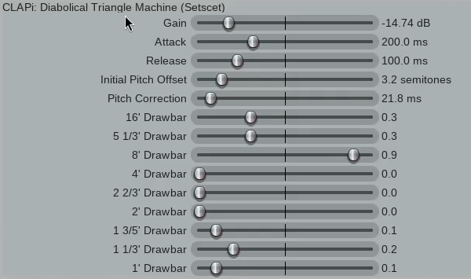

# Diabolical Triangle Machine

This is my first synth program. I wanted to learn audio programming as well as the Rust programming language. This uses NIH-plug (https://github.com/robbert-vdh/nih-plug).

It is all triangle waves as the name suggests, with the "drawbars" you would find on a hammond for overtones, although rather than being overtones each drawbar controls another triangle for each note. So there's a lot of weird harmonics here, but since triangles sound *a little bit* closer to sine waves, it seems to achieve an interesting effect.

There are also sliders to control an initial offset range, and a time to fade to the correct pitch. Essentailly, playing a note with these settings higher than 0 will play it at a random semitone offset and have it correct itself. This is just for an interesting effect.

I am now working on a gui, for now it uses the default controls in your daw, apologies for how ugly it is:


## Building

After installing [Rust](https://rustup.rs/), you can compile Diabolical Triangle Machine as follows:

```shell
cargo xtask bundle diabolical_triangle_machine --release
```

(CLAP and VST will be in the `/target` directory)
